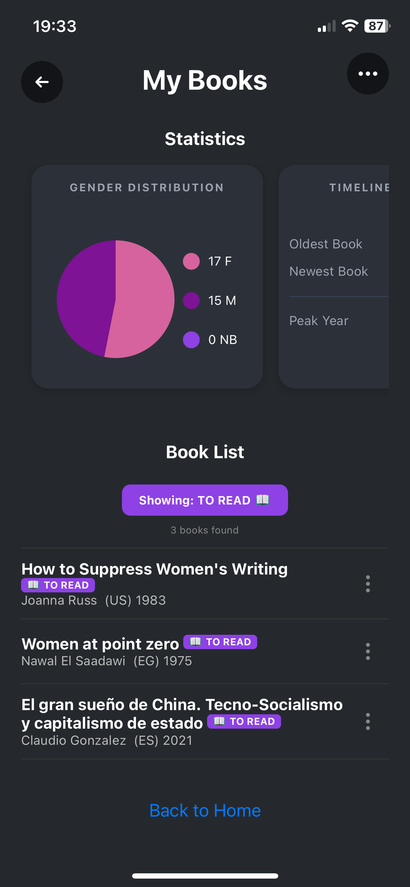
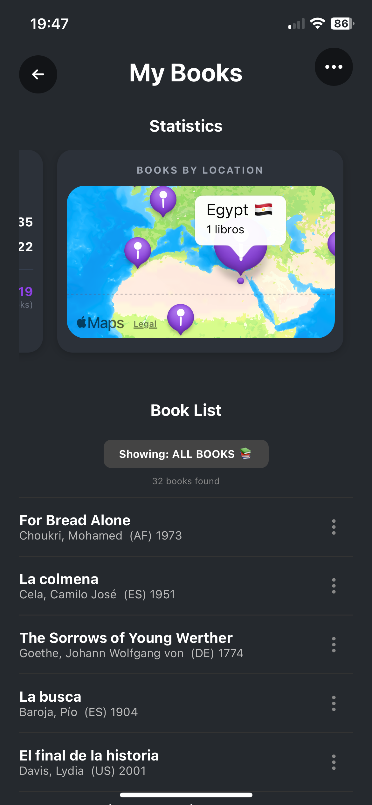
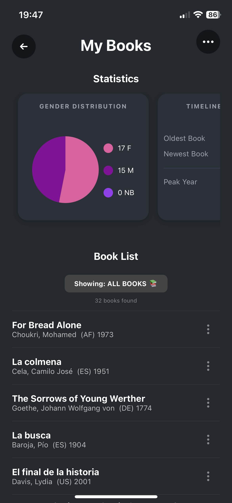
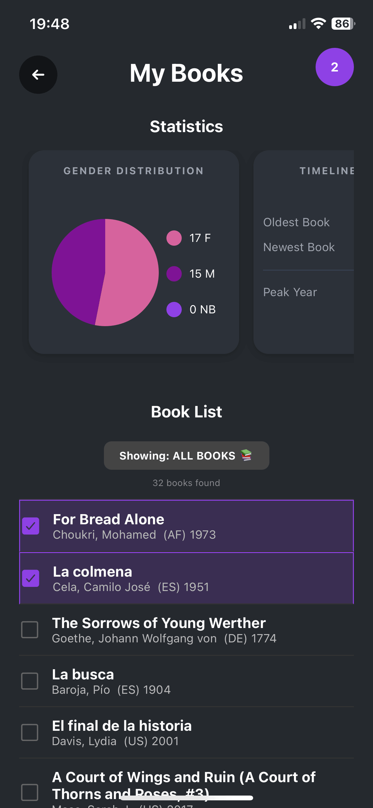
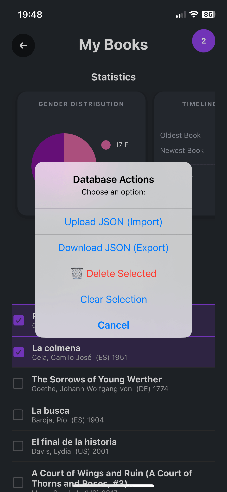

#  bookiest
---

### [Overview](#overview) • [📱 Screenshots](#screenshots) • [📥 Install](#download--install) • [📄 License](#license)

---

## Overview
This app was born out of my need to keep track of the books I'm reading. It's not the first time I've started a book full of enthusiasm only to realize after 20 pages that I've already read it. Or I constantly lose screenshots and text messages where I jot down my reading list. 

I didn't really like the book trackers out there, so I created my own. Simple, without too many fancy features I'd never use, and with no visual clutter. 

Feel free to install it ;)

## Screenshots
## 📱 Screenshots

<p align="center">

  <em>Library & Stats view</em>
<p align="center">
  
  
  
  
  
</p>

## Features


| Feature | Description |
| :--- | :--- |
| **Bulk upload/Dowload of data** | You can bulk upload/download your books using a JSON file, just make sure that is in the correct format |
| **Clear organization** | Organize books by status (To Read, Reading, Finished). | 
| **Reading insights** | Visual analytics of your reading habits, gender, number and nationality of authors, as well as the year range of your library. Custom data visualization with GoogleMaps |
| **Dark mode** | Full support for system-wide dark light-weight theme. |  


## Download & Install

First, add your Google Maps token in 

### 🍏 iOS (App Store / TestFlight)
1. Ensure you have **Xcode 14+** installed and a Apple developer account .
2. Clone the repo and run:
   ```bash
   cd ios && pod install && cd ..
   npx react-native run-ios # Or your framework command
   ```
For iOS if you dont want to pay the full Apple developer account fee, use PM2 on your own laptop. 

### 🤖 Android (Play Store / APK)

1. Enable Developer Options and USB Debugging on your device.
2. Run the following command:
   ```bash
    npx react-native run-android # Or your framework command
   ```

## License

This project is licensed under the **Creative Commons Attribution-NonCommercial 4.0 International (CC BY-NC 4.0)**.

- **Attribution**: You must give appropriate credit and provide a link to the original source.
- **Non-Commercial**: You may not use the material for commercial purposes.

See the [LICENSE](LICENSE) file for full details.
